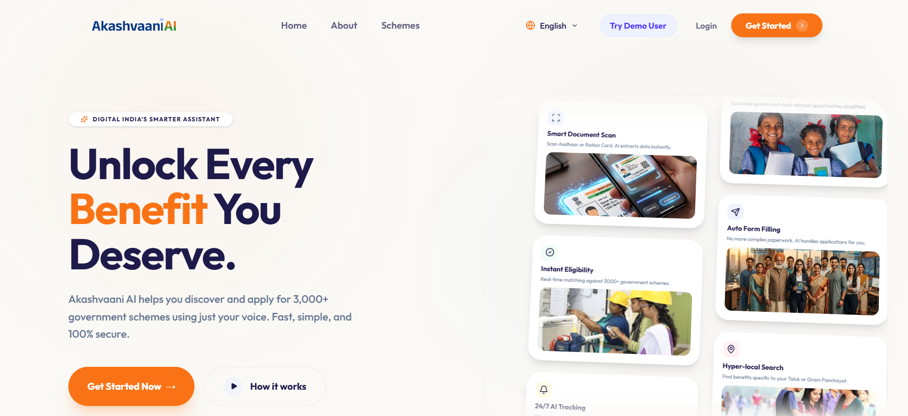
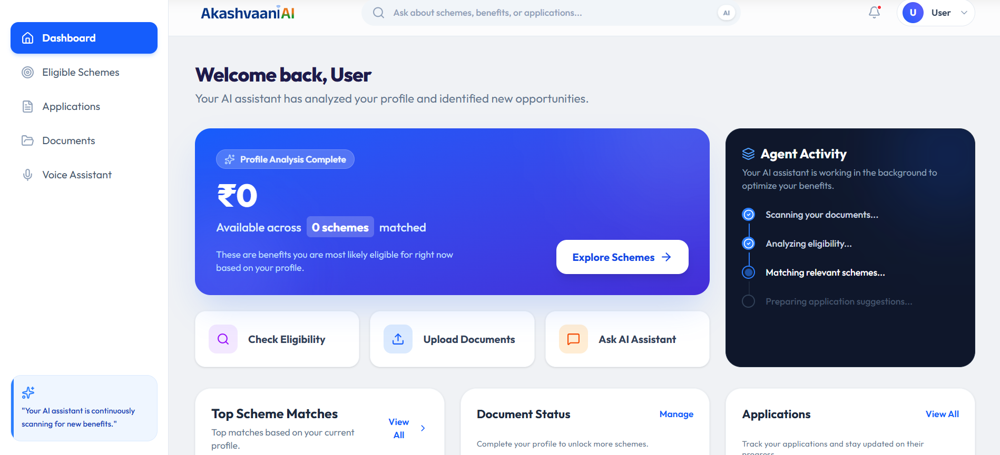
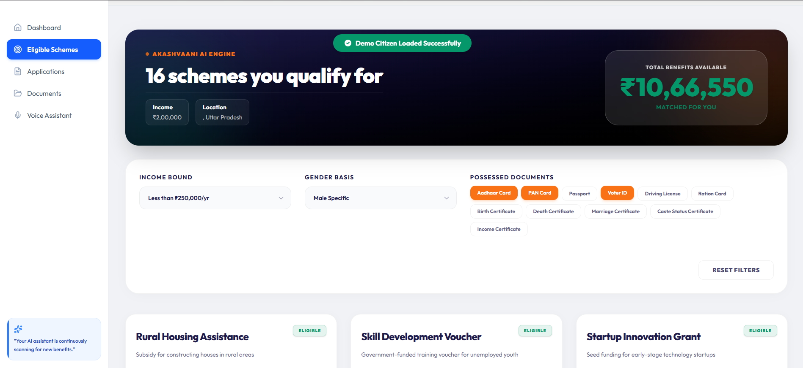
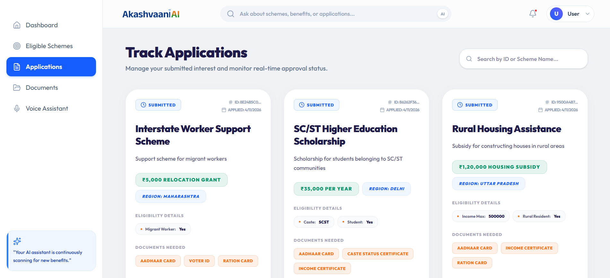
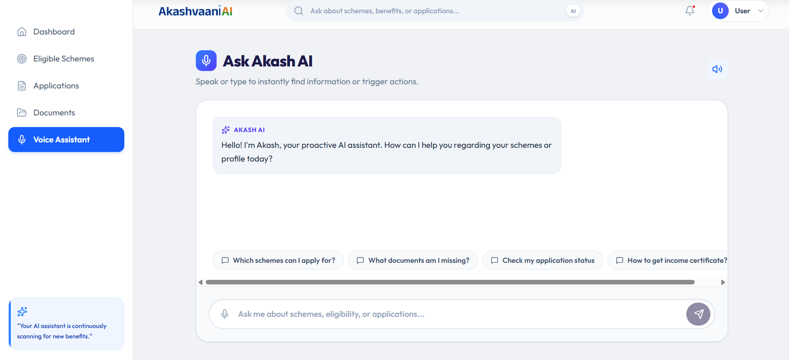

# Akashvaani AI

**An Agentic AI System for Intelligent Discovery and Access to Government Benefits**

Built at **HackMSIT 1.0 (10–11 April 2026)**  
Organized by **MSC MSIT** with **DomAIyn** as sponsor.

---

## Overview

Millions of citizens miss out on government schemes simply because they do not know they exist or struggle with complicated application systems. Government portals are fragmented, forms are tedious to fill, and navigating eligibility requirements often requires middlemen such as cyber cafés or agents.

Akashvaani AI solves this problem by acting as an **AI-powered government benefits advisor**.

Instead of manually searching through dozens of government websites, users simply upload their documents or speak to the assistant. The system automatically extracts their information, builds a verified citizen profile, analyzes eligibility against government schemes, and prepares applications.

The goal is simple:

**Help citizens discover and access government benefits instantly with AI.**

---

## Problem

Government welfare programs are designed to support citizens, yet access remains difficult.

Key issues include:

- Citizens **do not know which schemes apply to them**
- Government information is **scattered across multiple portals**
- Forms require **tedious manual filling**
- Many people struggle with **digital systems or typing queries**
- Millions of eligible citizens **miss benefits every year**

These barriers disproportionately affect the **next billion internet users**, including rural populations and first-time digital users.

---

## Solution

Akashvaani AI introduces a **multi-agent AI system** that acts as a digital advisor for government schemes.

The system:

- Understands citizen documents  
- Creates a structured citizen profile  
- Analyzes eligibility across government schemes  
- Calculates benefit value  
- Generates ready-to-submit applications  

The experience is designed to feel like speaking to an intelligent assistant rather than navigating bureaucratic systems.

---

## Core Features

### Smart Document Agent

Users can upload documents such as Aadhaar, income certificates, or marksheets.  
The system scans them and automatically extracts structured information to build a **verified citizen profile**.

### Instant Eligibility Check

Instead of searching manually, the AI compares the citizen profile against multiple government schemes and identifies the best matches.

### Multilingual Voice AI

Users can interact with the system using voice queries.  
The assistant understands natural language and simplifies complex policy information.

### Zero Manual Form Filling

Applications are automatically prepared using the extracted citizen data.

### Hyper-Local Scheme Discovery

The platform can identify **state, district, and local schemes** that general searches often miss.

---

## Three-Layer Intelligence (Core Innovation)

Akashvaani AI evaluates opportunities using three AI reasoning layers.

### Layer 1 — Eligibility Score

Determines whether a citizen qualifies for a scheme based on eligibility criteria.

### Layer 2 — Benefit Valuation

Estimates the potential financial benefit available from each scheme.

### Layer 3 — Document Readiness

Checks whether the user already possesses the required documents for application.

Together these layers answer three crucial questions:

- What do I qualify for?
- What is the total value of benefits available?
- Am I ready to apply?

---

## AI Agent System

Akashvaani AI operates as an **agentic AI pipeline** where specialized agents collaborate to produce results.

### OCR Agent

Extracts structured information from uploaded documents using OCR and AI processing.

### Eligibility Agent

Analyzes government scheme criteria and compares them against the citizen profile.

### Voice Agent

Processes voice queries and generates conversational responses for scheme discovery and guidance.

Each agent performs a focused task while the system orchestrates them into a unified workflow.

---

## Example User Journey

1. User opens the platform and begins eligibility check.  
2. User uploads Aadhaar or other identity documents.  
3. The Document Agent scans and extracts citizen data.  
4. A structured citizen profile is generated automatically.  
5. The Eligibility Agent analyzes government schemes.  
6. The system calculates benefit value and readiness score.  
7. Eligible schemes are displayed with benefit summaries.  
8. Applications are auto-generated with pre-filled data.

---

## Screenshots

### Landing Page

### Dashboard

### Schemes Page

### Application Page

### Voice Assistant Page

---

## Impact

Akashvaani AI aims to democratize access to government benefits by:

- Reducing dependence on intermediaries  
- Simplifying complex bureaucratic systems  
- Helping citizens discover schemes instantly  
- Enabling voice-based access for non-technical users  

The platform is designed for **large-scale citizen use** and can serve as a foundational GovTech infrastructure layer.

---

## Revenue Model

The system follows a **pay-per-use model** to prevent misuse by intermediaries.

- Scheme discovery and eligibility checks remain **free**
- AI-generated application submission costs **₹49 per application**

Additional revenue streams may include:

- Financial institution referrals for loan-based schemes  
- Vendor marketplace partnerships  
- Micro-insurance recommendations  

---

## Hackathon Context

This project was built during **HackMSIT 1.0**, a 24-hour hackathon focused on innovative technology solutions.

**Problem Track:** Open Innovation — Agentic AI GovTech

The project explores how autonomous AI agents can simplify government benefit discovery and application workflows.

---

## Future Roadmap

Planned enhancements include:

- Integration with real government APIs  
- DigiLocker identity verification  
- Support for hundreds of central and state schemes  
- Multilingual voice support for regional languages  
- Mobile and offline access for rural users  
- AI agents capable of submitting applications automatically  

---

## Team

**Diamonds**

- Aryan Das  
- Ayush Bhatt  
- Sandra Rosa Prince  
- Kartik Aggarwal  

---

## Vision

Akashvaani AI is designed to become a **digital bridge between citizens and government welfare systems**.

Instead of navigating complex bureaucratic portals, citizens will simply ask:

> **“Which government schemes am I eligible for?”**

And the AI will do the rest.
